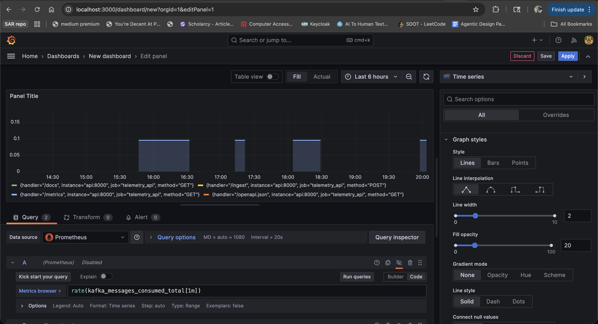
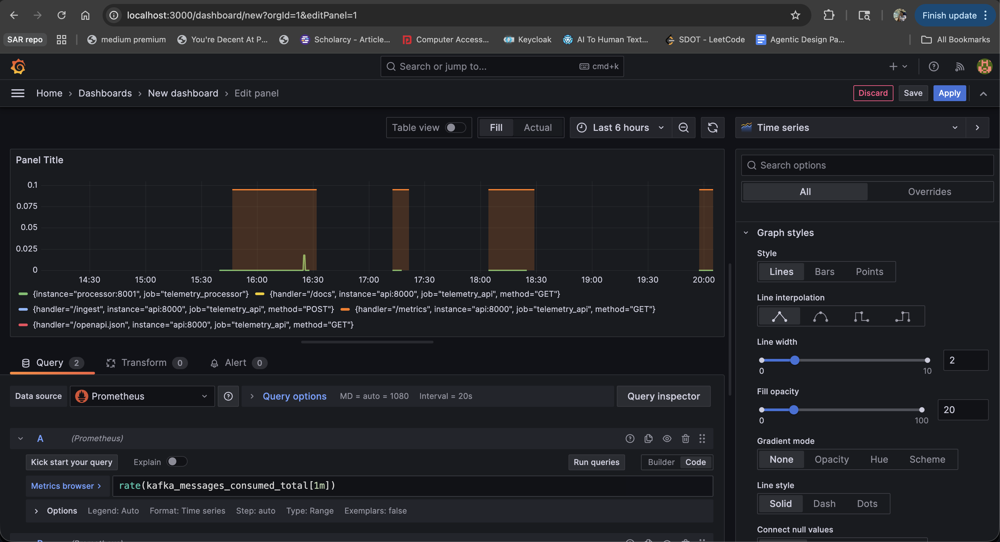
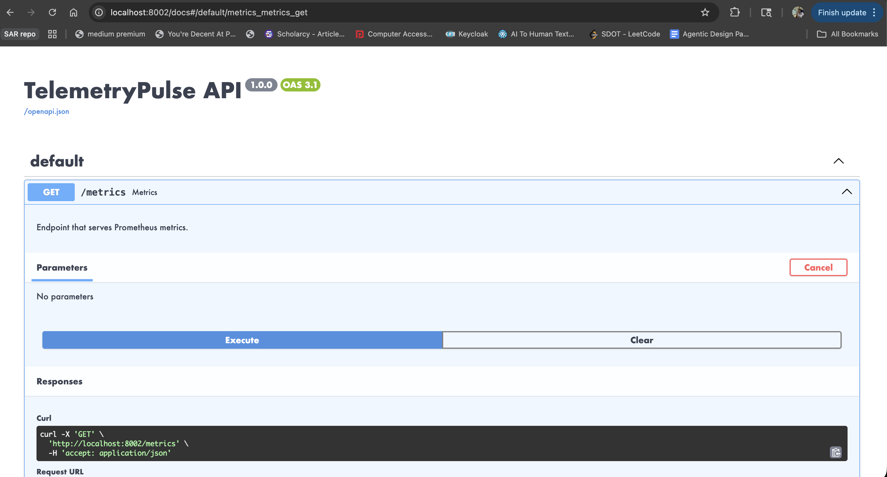
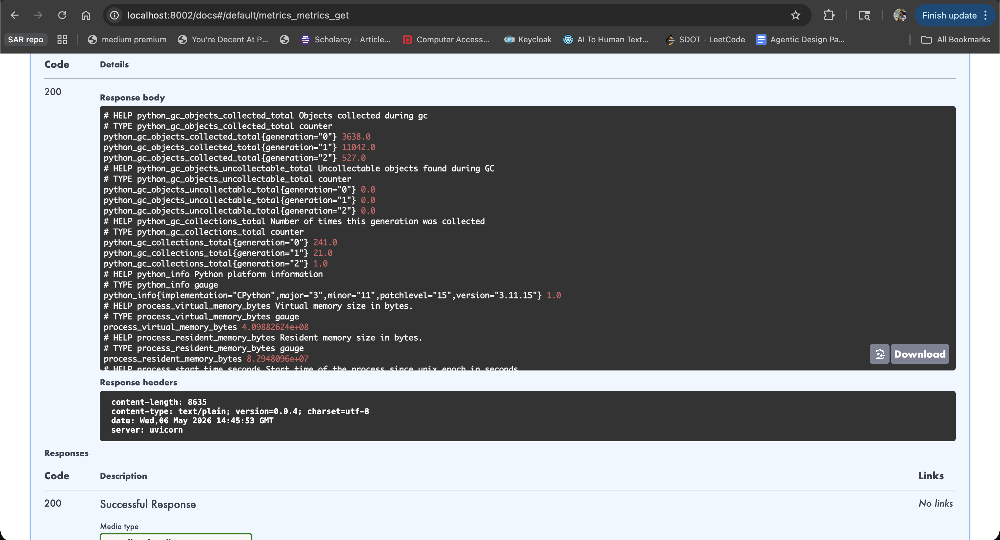
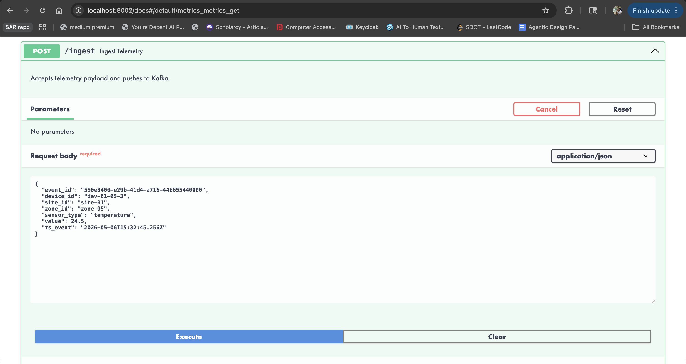
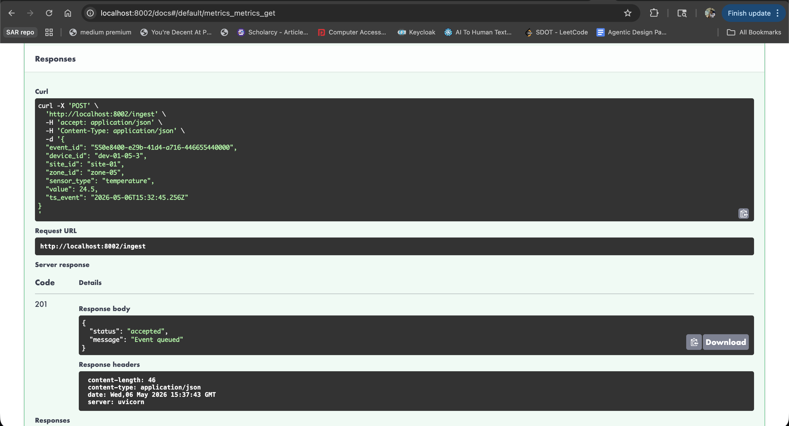
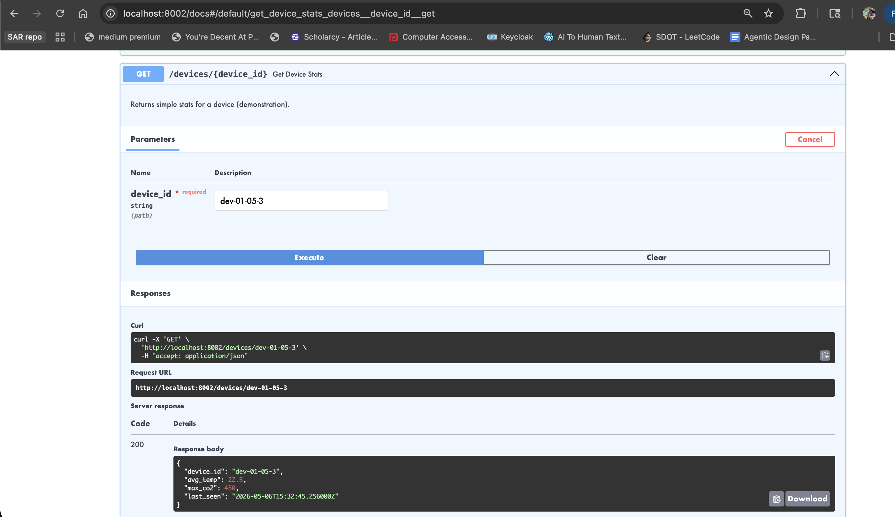

# TelemetryPulse 📡 (Production Edition)

TelemetryPulse is a production-grade, real-time IoT event pipeline. It simulates a smart building analytics system, ingesting sensor data (CO2, Temperature, Humidity) at high velocity, processing it via Kafka/Redpanda streams, and exposing real-time analytics via a robust FastAPI backend.

**Architecture**: Event-Driven Microservices (Python 3.11, Kafka, Postgres, Docker).

## 🚀 Key Features
*   **Real-Time Ingestion**: Handles high-throughput sensor streams via `/ingest` HTTP webhook or direct Kafka production.
*   **Windowed Aggregation**: Calculates live statistics (Avg/Min/Max) per 5-minute tumbling windows.
*   **Intelligent Alerting**: Instantly thresholds anomalies (e.g., CO2 > 1000ppm).
*   **Production Ops**:
    *   **Structured Logging**: JSON logs for Splunk/Datadog integration.
    *   **Resilience**: Auto-reconnecting DB sessions and Kafka consumers.
    *   **CI/CD**: Automated testing via GitHub Actions.

## 📊 Observability & Dashboards
The system includes a production-grade observability stack tracking 5000+ events per second.

### Grafana Dashboards



### Prometheus Targets & Metrics



### FastAPI Swagger UI


### Terminal Logs & Alertmanager




## 📂 Project Structure
Emulates a standard enterprise monorepo:
```
TelemetryPulse/
├── src/
│   ├── api/          # FastAPI Routes & Schemas
│   ├── db/           # SQLAlchemy Models & Sessions
│   ├── services/     # Core Business Logic (Ingest, Aggregation)
│   ├── utils/        # Shared Utilities (Logging, Validators)
│   ├── simulator_main.py  # IoT Device Simulator Entrypoint
│   └── processor_main.py  # Stream Processor Entrypoint
├── tests/            # Pytest Suite
├── docker-compose.yml # Local Dev Infrastructure
└── requirements.txt  # Project Dependencies
```

## 🛠️ Quick Start

### 1. Start Infrastructure
```bash
make up
# OR
docker-compose up -d --build
```
This spins up: **Redpanda** (Kafka), **Console**, **Postgres**, **API**, **Stream Processor**, and **Simulator**.

### 2. Verify
*   **API Docs**: [http://localhost:8000/docs](http://localhost:8000/docs)
*   **Redpanda Console**: [http://localhost:8080](http://localhost:8080)
*   **Database**: `localhost:5432` (User: `admin`, Pass: `password`)

### 3. Check Live Data
Direct your browser or curl to:
```bash
curl http://localhost:8000/devices/dev-01-01-01
```

## 🧪 Testing
Run the test suite locally:
```bash
make test
```

## ☁️ Deployment
*   **Platform**: Render (Compute) + Aiven (Kafka) + Neon (Postgres).
*   **Config**: See `render.yaml`.
